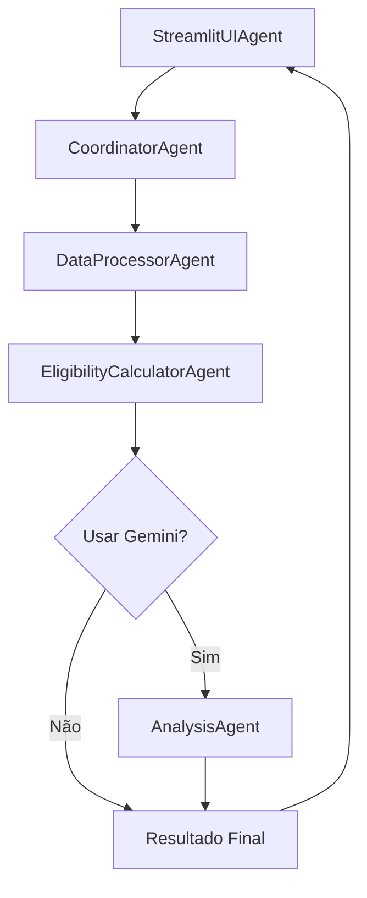

# Sistema de Cálculo de Benefícios - Arquitetura Agent-to-Agent (A2A)

Uma aplicação web interativa desenvolvida com arquitetura multi-agente para calcular benefícios de vale alimentação/refeição de funcionários.

## 🤖 Arquitetura Agent-to-Agent

Este sistema utiliza uma arquitetura inovadora de agentes especializados que se comunicam entre si para processar dados de forma eficiente e inteligente.

### Agentes Especializados

1. **DataProcessorAgent** 📊
   - Responsável por extrair e unificar dados de múltiplas planilhas
   - Padroniza nomes de colunas e remove duplicatas
   - Processa arquivos ZIP contendo Excel/CSV

2. **EligibilityCalculatorAgent** ⚖️
   - Aplica regras de elegibilidade para benefícios
   - Calcula valores finais com ajustes por sindicato
   - Gera resumos e métricas detalhadas

3. **AnalysisAgent** 🧠
   - Integra com Google Gemini via LangChain
   - Gera análises detalhadas e insights
   - Produz resumos executivos e explicações

4. **CoordinatorAgent** 🎯
   - Orquestra o fluxo de trabalho usando LangGraph
   - Gerencia estado e comunicação entre agentes
   - Controla execução condicional (com/sem IA)

5. **StreamlitUIAgent** 🖥️
   - Interface do usuário interativa
   - Gerencia uploads e downloads
   - Exibe resultados e análises

## 🚀 Funcionalidades

- 📁 Upload de arquivos ZIP com múltiplas planilhas
- 🔍 Processamento automático com agentes especializados
- 💰 Cálculo de ajustes por sindicato (SP, RJ, PR, RS)
- 🤖 Análise inteligente opcional com Google Gemini
- 📊 Visualização de resultados e métricas
- 💾 Download de relatórios em Excel e CSV
- 🎨 Interface moderna e responsiva

## 🛠️ Tecnologias Utilizadas

- **Backend**: Python
- **Frontend**: Streamlit
- **Orquestração**: LangGraph
- **IA**: Google Gemini via LangChain
- **Processamento**: Pandas, OpenPyXL
- **Implantação**: Render.com

## 📋 Critérios de Elegibilidade

Funcionários **inelegíveis** para benefícios:
- Estagiários
- Aprendizes
- Diretores
- Funcionários afastados
- Funcionários demitidos
- Funcionários no exterior

## 💰 Ajustes por Sindicato

- **SP**: R$ 50,00
- **RJ**: R$ 70,00
- **PR**: R$ 60,00
- **RS**: R$ 80,00

## 🏗️ Estrutura do Projeto

```
benefit_calculator_app/
├── agents/                    # Agentes especializados
│   ├── __init__.py
│   ├── data_processor_agent.py      # Processamento de dados
│   ├── eligibility_calculator_agent.py  # Cálculo de elegibilidade
│   ├── analysis_agent.py            # Análise com Gemini
│   └── coordinator_agent.py         # Coordenação com LangGraph
├── ui/                        # Interface do usuário
│   ├── __init__.py
│   └── streamlit_ui_agent.py        # Interface Streamlit
├── app.py                     # Aplicação principal
├── requirements.txt           # Dependências Python
├── render.yaml               # Configuração para Render.com
└── README.md                 # Este arquivo
```

## 🔧 Instalação Local

1. Clone o repositório
2. Crie um ambiente virtual:
   ```bash
   python -m venv venv
   source venv/bin/activate  # Linux/Mac
   # ou
   venv\Scripts\activate  # Windows
   ```
3. Instale as dependências:
   ```bash
   pip install -r requirements.txt
   ```
4. Configure a variável de ambiente (opcional):
   ```bash
   export GOOGLE_API_KEY=sua_chave_api_aqui
   ```
5. Execute a aplicação:
   ```bash
   streamlit run app.py
   ```

## 🎯 Como Usar

1. Acesse a aplicação no navegador
2. Observe os agentes especializados na barra lateral
3. Configure se deseja usar análise com IA (Gemini)
4. Faça o upload de um arquivo ZIP contendo planilhas
5. Clique em "🚀 Processar com Agentes"
6. Acompanhe o processamento pelos agentes
7. Visualize os resultados e análises
8. Faça download dos relatórios

## 🔄 Fluxo de Processamento



## 🌐 Implantação

A aplicação está configurada para implantação automática no Render.com:

1. Conecte seu repositório Git ao Render.com
2. Configure a variável de ambiente `GOOGLE_API_KEY` (opcional)
3. A aplicação será implantada automaticamente usando `render.yaml`

## 🤝 Contribuição

Este projeto demonstra uma arquitetura agent-to-agent inovadora para processamento de dados corporativos. Contribuições são bem-vindas!

## 📄 Licença

Desenvolvido com apoio da Manus AI - Sistema Agent-to-Agent para Cálculo de Benefícios.

